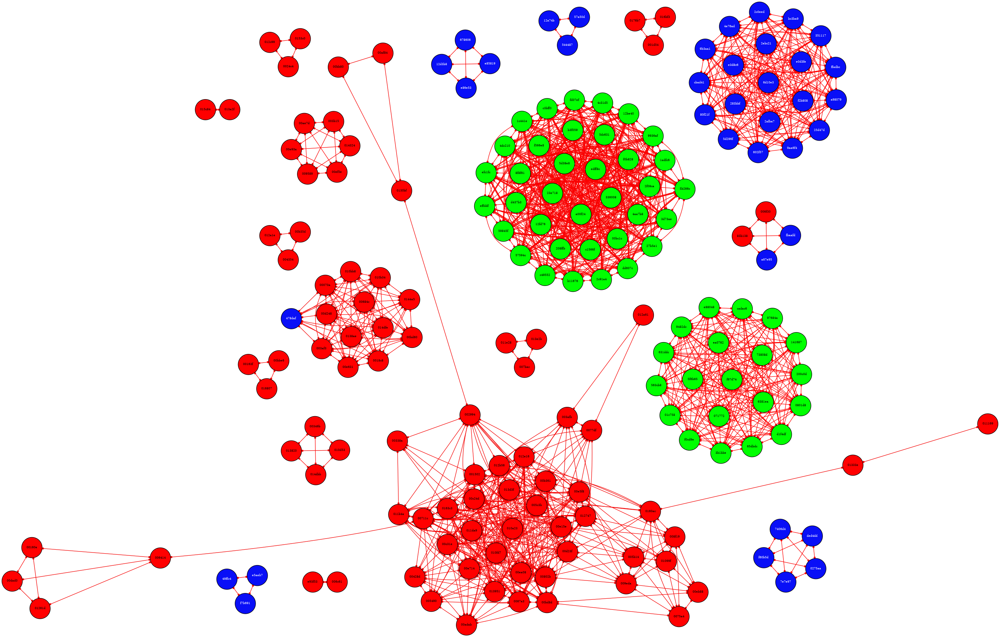
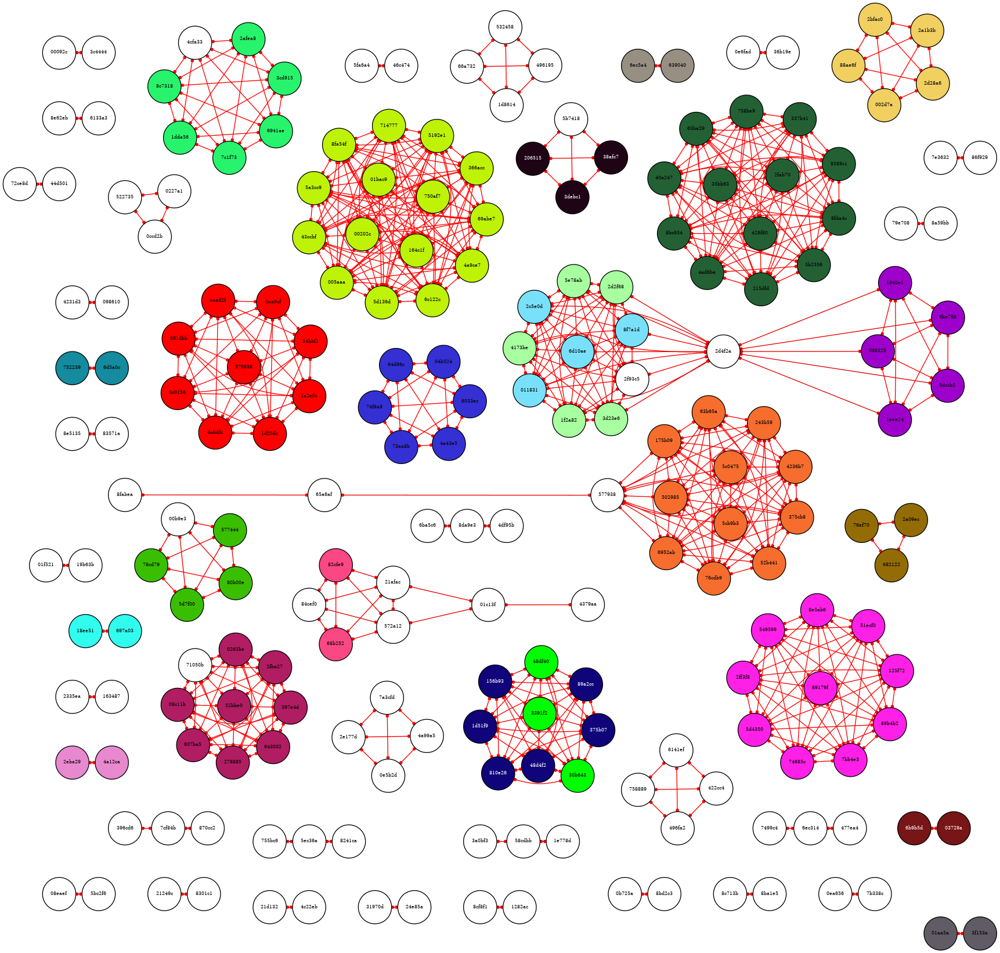
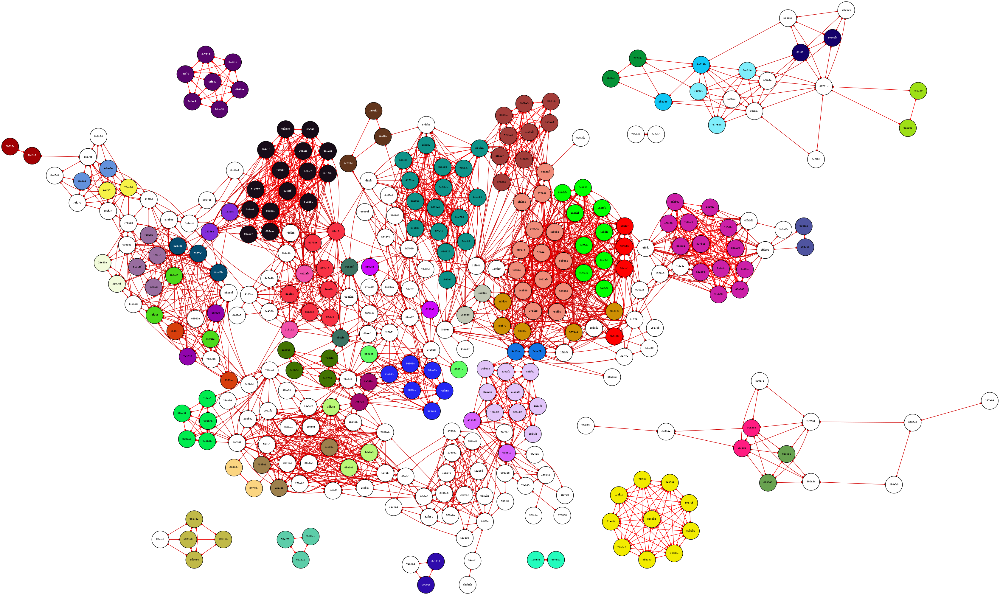
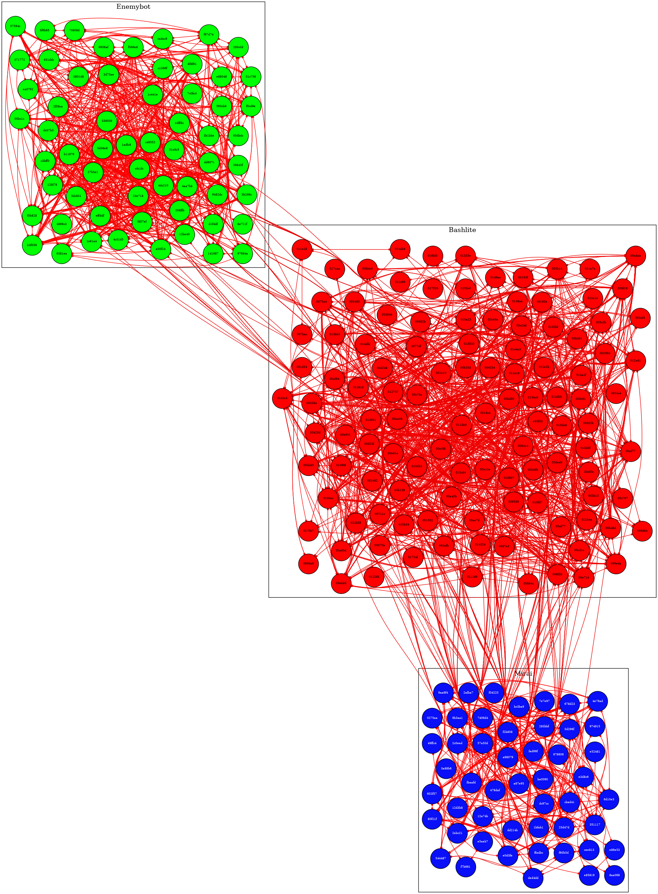

# Malkom

Malkom is an extensible and simple similarity graph generator for malware analysis aimed at helping analysts visualize and cluster sets of PE and ELF malware samples.

Malkom extracts all the metrics from the input samples. Then it uses the selected metric to compute the similarity between each pair of samples and generate a `Graphviz` graph showing the relationship between the samples. Edges are placed between samples that have the selected `--metric` above a certain `--threshold` value.

Note that most use cases and supported metrics in Malkom generate very dense graphs, so a set of 1.000 samples could really generate up to 500.000 edges. Malkom is designed solely for experimentation & analysis purposes; depending on your setup and sample set, Malkom is likely to use a lot of RAM.

## Supported Metrics

* `tlsh`. [TrendMicro's TLSH](https://github.com/trendmicro/tlsh) (PE)
* `telfhash`. [TrendMicro's Telfhash](https://github.com/trendmicro/telfhash) (ELF)
* `ssdeep`. [SSDeep](https://ssdeep-project.github.io/ssdeep/) (PE/ELF)
* `imphash`. [Mandiant's Imphash](https://www.mandiant.com/resources/blog/tracking-malware-import-hashing) (PE)
* `elfsymbols`. Symbol-Set Jaccard (ELF)
* `peimports`. Imports-Set Jaccard (PE)
* `peexports`. Exports-Set Jaccard (PE)
* `overhash`. Overhash is simply the SHA256 of the overlay, if present in the binary. (PE/ELF)

Some of these metrics (`imphash` and `overhash`) induce *exact* similarity values (100% or 0%) instead of percentages. Therefore, if using these metrics, any positive threshold will have the same effect. This doesn't mean that they can't be used for comparative analyses, and that's why they were included in the tool.

# Setup

Malkom uses the `dot` command from Graphviz to render the graph, so you need Graphviz installed in your distro in order to export a visual representation of the graph. It may also be needed to install `libfuzzy-dev` in order to obtain required headers for `ssdeep`:

```bash
$ apt install graphviz libfuzzy-dev
```

Python dependencies are managed by `pipenv`. To make a new environment with all the dependencies run:

```bash
$ pipenv install
```

# Usage
Whenever you want to run malkom in a new shell, you must activate the environment:

```bash
$ pipenv shell
```

And then run the following to compute the metrics and plot the graph in PDF:

```bash
$ ./malkom.py <OUTPUT_NAME> --plot --ext pdf --indir <SAMPLES_FOLDER> --metric <CHOSEN_EDGE_METRIC> --threshold <EDGE_THRESHOLD>
```

Where:
* `<OUTPUT_NAME>` is an arbitrary friendly name for your experiment that will be used to prefix the results in the output directory.
* `<SAMPLES_FOLDER>` is a directory with malware samples.
* `<CHOSEN_EDGE_METRIC>` is the selected metric to evaluate against the threshold to build graph edges.
* `<EDGE_THRESHOLD>` is the threshold to use to build graph edges. If the similarity between the metric values of each two samples is above the threshold then an edge will be inserted into the graph.

You might prefer to also use `--write-mkm` in the first run in order to cache the computed metrics for the samples set in the `cache` directory. Then you can use `--mkm` for subsequent plots to specify the pre-computed MKM file instead of using `--indir`.

Example:
```bash
$ ./malkom.py myexperiment --indir mysamplesdir --write-mkm
$ ./malkom.py myexperiment --mkm cache/myexperiment.mkm --plot --metric tlsh --threshold 90 --plot --ext pdf
```

If you provide `--indir`, `--mkm` and `--write-mkm`, the MKM file provided with `--mkm` will be incremented with the metrics computed from the `--indir` directory and saved into `results/<OUTPUT_NAME>.mkm`. This behavior can be used to build large MKM files containing useful metadata for multiple sets of samples, without having to keep the samples themselves in the disk. Example:

```bash
$ ./malkom.py myexperiment --indir newsamples --mkm cache/myexperiment.mkm --write-mkm
```

## Optional Flags
* `--outdir`. Output directory (default: `results`).
* `--plot`. Plot graph from Graphviz dot file (default: `False`).
* `--colors`. Colorize nodes based in the provided JSON file mapping SHA256s to RGB colors (default: `colors.json`).
* `--write-colors`. Write color mappings in results directory based in the components found with the specified metric and threshold (default: `False`).
* `--mkm`. MKM file to use as input instead of extracting metrics from a directory of samples (default: `None`).
* `--write-mkm`. Save metrics information in MKM file (default: `False`).
* `--write-gexf`. Write graph in GEXF (Graph Exchange XML Format) in results directory (default: `False`).
* `--stats`. Compute statistics on the constructed graph (default: `False`).
* `--isolates`. Show isolated nodes - those without similarity to any other nodes (default: `False`).
* `--layout-engine`. Layout engine to use for graph plot (default: `sfdp`).
* `--archs`. Allowed architectures (default: `None`).
* `--ext`. Extension for Graphviz plot (default: `png`).
* `--metadata`. JSON file mapping SHA256s to metadata dictionary to import into the MKM. These metadata can be used for clustering or labelling (default: `metadata.json`). Read the *Use cases* section for more information on this option.
* `--clusters`. Cluster nodes by the "cluster" key from their metadata into Graphviz subgraphs (default: `False`).
* `--groups`. Show members of each connected component (default: `False`).
* `--verbose`. Enable verbose mode (default: `False`).

# Use cases

## Coloring the graph with ground-truth for malware families

You can specify custom fill/text colors for each SHA256 in the `colors.json` file to help visualize, for example, different families of malware. Besides that, if you don't care much about the specific colors used but you have a CSV with malware families for each SHA256 in your sample set, you can use the `csv2colors.py` utility to automatically generate a reasonable `colors.json` file from your families. Example:

**malware-families.csv**
```
SHA256,Family
f97d74ac49a75219ac40e8612a0ec0a829ed9daac2d913221115562c219c99b7,Enemybot
fd07ef316187f311bec7d2ff9eb793cc3886463ebae9445c9f89903b66727832,Enemybot
283bbfca166becfbaa701a28b973dbe4903732a69bc50a22d0879ddddfe7bf25,Mirai
fbaafdd070c20de4b0da48a37b950f968ffca16c354b9416b40e0727b854fd8d,Mirai
47832322d8314b87d1187e0aee9289649b86edc60e7de9ebc36ff5b6ddb92ee0,Mirai
...
```

```bash
$ python3 csv2colors.py malware-families.csv > colors.json
```

```bash
$ python3 malkom.py myexperiment --mkm cache/myexperiment.mkm --colors colors.json --metric telfhash --threshold 90 --plot
```



## Comparing connected components with colors

When using `--write-colors`, Malkom will generate a color for each connected component in the final graph and save the colors into the `results/<output_name>.colors.json` file. The colors JSON can then be specified with the `--colors` flag to use the same node colors in subsequent plots.

For example, if you already have an MKM file with your precomputed metrics, you can compare `ssdeep` and `tlsh` results with this sequence:

```bash
$ ./malkom.py myexperiment --mkm cache/myexperiment.mkm --write-colors --metric ssdeep --threshold 90
$ ./malkom.py myexperiment --mkm cache/myexperiment.mkm --colors results/myexperiment.colors.json --metric tlsh --threshold 90 --plot
```



You can also plot the same metric with different thresholds for colors and edges, which can be useful to determine variants of malware families:

```bash
$ ./malkom.py myexperiment --mkm cache/myexperiment.mkm --write-colors --metric tlsh --threshold 90
$ ./malkom.py myexperiment --mkm cache/myexperiment.mkm --colors results/myexperiment.colors.json --metric tlsh --threshold 80 --plot
```



## Using metadata to enrich the graph with custom labels and clusters

If you have strings that you want to use to cluster the resulting graph, such as ground truths for the malware family of each sample, you can specify them in the `cluster` key of each SHA256 in the metadata dictionary. Then you can plot the graph with `--clusters --layout-engine fdp --plot` to get a graph where the nodes with the same `cluster` key are grouped together.

If you want to label the nodes with custom labels instead of the prefix of their hashes, you can also specify the labels in the `label` keys of the metadata dictionary.

Example:

```json
{
    "SHA256_OF_SAMPLE_1": {
        "cluster": "Bashlite",
        "label": "MySample1"
    },
    "SHA256_OF_SAMPLE_2": {
        "cluster": "EnemyBot",
        "label": "MySample2"
    },
    ...
}
```

```bash
$ python3 ./malkom.py myexperiment --mkm cache/myexperiment.mkm --colors colors.json --metric telfhash --threshold 90 --clusters --layout-engine fdp --plot
```



## Computing graph statistics

If you provide the `--stats` flag, Malkom will compute the following statistics and store them in `results/<output_name>.stats.json`:

* Total nodes per component (`n_nodes_per_component`)
* Average nodes per component (`avg_nodes_per_component`)
* Average similarity per component (`avg_weights_per_component`)
* Variance of similarity per component (`var_weights_per_component`)
* Average clustering coefficient (`avg_clust`)
* Number of isolate nodes (`n_isolates`)
* Number of maximal cliques (`n_maximal_cliques`)

## Analyzing the graph with 3rd-party tools

By default, Malkom will generate the `.dot` file for the graph in `results/<output_name>.dot`. You can omit the `--plot` flag if you don't want to plot the graph with Malkom, and then load the `.dot` in graph analysis tools such as [Gephi](https://gephi.org/) or [Cytoscape](https://cytoscape.org/). Exporting the graph in GEXF format into `results/<output_name>.gexf` is also supported by specifying the `--write-gexf` flag.

## Using MKM files for external analyses

MKM files are just GZIP-compressed JSON files mapping SHA256s to metadata information and pre-computed metrics, so you can easily convert them to a regular JSON objects with `zcat`:

```bash
$ zcat <output_name>.mkm > plainmkm.json
```

Then you can use this data for other analyses outside of Malkom, or just inspect it to understand the results.

# Extending functionality

The base Graph object from Graphviz is provided to the initializer of the Malkom class; it can be customized with other [graph attributes](https://graphviz.org/docs/graph/) before calling `build_graph`:

```python
dot = Graph(
    graph_attr=[('outputorder', 'edgesfirst')],
    edge_attr=[
        ('dir', 'both'), ('arrowhead', 'dot'),
        ('arrowtail', 'dot'), ('arrowsize', '0.4')
    ]
)

malkom_obj = Malkom(outname, dot, ...)
```

By default, edges are colored simply using red if `s >= threshold`, but *both edges and nodes* can be colored according to a custom function provided in the `colorize_nodes` and `colorize_edges` named arguments of the `build_graph` method. A custom labeller for the nodes can also be specified in the `node_labeller` named argument, and Malkom will only fall back to the prefix of the hash if the custom labeller returns `None`. An example from the default implementation:

```python
# Load the colors from the file into the `colors` dictionary
colors = {}
try:
    with open(args.colors) as f:
        colors = json.load(f)
    print(f'[+] Colors: "{args.colors}"')
except Exception:
    print(f'[~] Could not open colors file "{args.colors}". Ignoring...')]

def get_node_color(mkm_obj, fhash):
    if fhash in colors:
        return colors[fhash]

    return ((255, 255, 255), (0, 0, 0))

# Load the threshold from the parsed argument into the `threshold` variable
threshold = args.threshold / 100.0

def get_edge_color(metric_value):
    ecolor = None

    if metric_value >= threshold:
        ecolor = rgb2hex((round(metric_value * 255), 0, 0))

    return ecolor

# Load the metadata from the metadata file into the `metadata` dictionary
metadata = {}
try:
    with open(args.metadata) as metadatafile:
        metadata.update(json.load(metadatafile))

    print(f'[+] Metadata: "{args.metadata}"')
except Exception:
    print(f'[~] Could not open metadata file "{args.metadata}". Ignoring...')

def get_metadata_label(fhash):
    if fhash in metadata and 'label' in metadata[fhash]:
        return metadata[fhash]['label']

# Call build_graph on our Malkom object with the specified functions as arguments
malkom.build_graph(isolates=False,
                    colorize_node=get_node_color,
                    colorize_edge=get_edge_color,
                    node_labeller=get_metadata_label)
```

Also note that the `build_graph` method of a Malkom object stores the resulting graph as a NetworkX graph in `malkom_obj.nx` in order to compute connected components. Therefore, after a call to `malkom_obj.build_graph()`, you can leverage this fact to run [graph analysis algorithms provided by NetworkX](https://networkx.org/documentation/stable/reference/algorithms/index.html) on top of your malware graph.

Example:
```python
import networkx

malkom_obj = Malkom(...)

malkom_obj.build_graph(...)

print(networkx.k_components(malkom_obj.nx))
```

# Contributing

Contributions are welcome by [opening an issue](https://github.com/Macmod/malkom/issues/new) or by [submitting a pull request](https://github.com/Macmod/malkom/pulls).

# Todo

* Implement colorized output
* Implement subparsers to split the workflow into steps (maybe)
* Possible metrics for future implementation: gimphash, pehash, impfuzzy, lzjd
* Add options for plot style
* Make plot command secure
* Improve code with type hints

# License
The MIT License (MIT)

Copyright (c) 2023 Artur Henrique Marzano Gonzaga

Permission is hereby granted, free of charge, to any person
obtaining a copy of this software and associated documentation
files (the "Software"), to deal in the Software without
restriction, including without limitation the rights to use,
copy, modify, merge, publish, distribute, sublicense, and/or sell
copies of the Software, and to permit persons to whom the
Software is furnished to do so, subject to the following
conditions:

The above copyright notice and this permission notice shall be
included in all copies or substantial portions of the Software.

THE SOFTWARE IS PROVIDED "AS IS", WITHOUT WARRANTY OF ANY KIND,
EXPRESS OR IMPLIED, INCLUDING BUT NOT LIMITED TO THE WARRANTIES
OF MERCHANTABILITY, FITNESS FOR A PARTICULAR PURPOSE AND
NONINFRINGEMENT. IN NO EVENT SHALL THE AUTHORS OR COPYRIGHT
HOLDERS BE LIABLE FOR ANY CLAIM, DAMAGES OR OTHER LIABILITY,
WHETHER IN AN ACTION OF CONTRACT, TORT OR OTHERWISE, ARISING
FROM, OUT OF OR IN CONNECTION WITH THE SOFTWARE OR THE USE OR
OTHER DEALINGS IN THE SOFTWARE.
